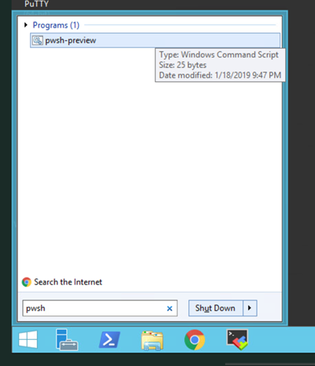

| Difficulty level: Beginner |
| --- |

# Lesson 1: Preparing the Lab

To prepare for this module's lab, you will need to configure a new session using PowerShell Core and install the latest version of the Rubrik SDK for PowerShell.

## Lesson 1-1: Starting a Powershell Core Session

Launch an instance of PowerShell Core:

1. Click Start and type `pwsh`
1. This will find the program named either `pwsh` or `pwsh-preview` on your server.



A terminal-style window will open with your new PowerShell Core session. Yay! With great power comes great responsibility. :)

### Check the PowerShell Core Version

Check the version of PowerShell Core that is running on your server:

`$PSVersionTable`

You should see a result similar to this:

```
Name                           Value
----                           -----
PSVersion                      6.2.0
PSEdition                      Core
GitCommitId                    6.2.0
OS                             Microsoft Windows 10.0.17134
Platform                       Win32NT
PSCompatibleVersions           {1.0, 2.0, 3.0, 4.0…}
PSRemotingProtocolVersion      2.3
SerializationVersion           1.1.0.1
WSManStackVersion              3.0
```

It's OK if your version is slightly different. So long as you have a 6.x.x version of PowerShell Core installed, you are good to proceed.

## Lesson 1-2: Installing the Rubrik SDK for PowerShell

The PowerShell Gallery is a publicly available marketplace where different modules are uploaded by Microsoft, Rubrik, and many others. If you've ever used yum, apt-get, chocolately, or other package managers, this is similar in concept.

Let's see what modules have been installed on your server:

`Get-InstalledModule`

This will show all modules that have been installed within the PowerShell Core environment. You can use these modules to extend the core functionality of PowerShell with other platforms such as Rubrik.

It's OK if you don't see any results when you run the command. This just means that you don't have any modules installed using the `Install-Module` cmdlet. If you installed a module manually (copying it over as a set of files, for example) the module will not show up in this list.

*Tip: It's best to install modules from the PowerShell Gallery or some other repository when at all possible. This allows you to quickly deploy and upgrade modules to one or more servers without having to fuss around with file copies.*

### Search the PowerShell Gallery

Do you see the Rubrik module installed? Probably not! Let's remedy that now.

Find the Rubrik SDK for PowerShell on the PowerShell Gallery:

`Find-Module -Name Rubrik`

You should see an output similar to this:

```
Version              Name                                Repository           Description
-------              ----                                ----------           -----------
4.0.0.276            Rubrik                              PSGallery            This is a community project that provide…
```

### Install the Rubrik SDK for PowerShell Module

Now that we've found the correct module in the gallery, let's install it:

`Install-Module -Name Rubrik`

Since this is your first time using the PowerShell Gallery an untrusted repository message will appear. We are OK with accepting a module from the repository named `PSGallery` in the lab environment. However, in a real, production environment, you would want to validate the module prior to consumption and ensure that you are loading the module intended.

Type `Y` and hit enter to continue with the installation.

### Validate the Installation

Check to make sure the module has been installed on your server:

`Get-InstalledModule`

You should now see a list of installed modules. It should include one named Rubrik.

```
Version    Name                                Repository           Description
-------    ----                                ----------           -----------
4.0.0.276  Rubrik                              PSGallery            This is a community project that provides a Wind...
```

You are now ready to continue to the next lab.
