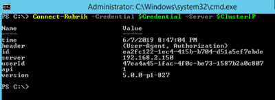

| Difficulty level: Beginner |
| --- |

# Lesson 2: Setting Variables and Authenticating

Now that you have configured your lab environment with a PowerShell Core session and the Rubrik SDK for PowerShell, it's time to work with Rubrik! For this to be successful, you will be storing your credentials and server IP into variables and then establishing a connection to the Rubrik cluster.

## Lesson 2-1: Defining Variables

To begin, we'll re-use the same PowerShell Core session from Lesson 1. Make sure it is open and ready to accept commands.

We're going to define two different variables:

* `$Credential` will store the administrative username and password for the Rubrik cluster.
* `$ClusterIP` will store the IP address of a node in the Rubrik cluster.

### Creating a Credential Object

Let's start with the `$Credential` variable. We're going to use the `Get-Credential` cmdlet to request a secure and encrypted credential object.

`$Credential = Get-Credential`

At this point, PowerShell will ask for the username and password:

```
PowerShell credential request
Enter your credentials.
User: admin
Password for user admin: ***********
```

With that complete, you can now see what is stored in `$Credential`:

```
C:\> $Credential

UserName                     Password
--------                     --------
admin    System.Security.SecureString
```

Note that the password value is `System.Security.SecureString` and is not displayed to the console. It has been encrypted in memory using your private user session. It's best to NEVER store a password in plain text, even if you are the only user on a system.

### Setting the Cluster IP Address

Next, set the cluster IP address. Make sure to encapsulate the IP address in single quotes since an IP address is a string (not an integer).

`$ClusterIP = '192.168.2.150'`

## Lesson 2-2: Connect to the Rubrik Cluster

Now that you have two variables that are storing your credentials and cluster IP address, it's time to connect to the Rubrik cluster. Rather than mucking around in a playground or making long requests using curl, we're going to vastly simplify the process by using the Rubrik SDK for PowerShell. This module contains a function specifically written to make connecting to the cluster simple and easy.

`Connect-Rubrik -Credential $Credential -Server $ClusterIP`



You should see a table of data returned to you that describes:

* The time of the connection
* The `id` value of your session
* The server IP address (that matches the `$ClusterIP` value)
* Your `userId` value
* The API version used to connect
* The Rubrik cluster version (also known as the CDM version)

You are now ready to continue to the next lab.
