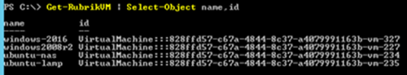

| Difficulty level: Intermediate |
| --- |

# Lesson 3: Using the Rubrik SDK for PowerShell

Wow, you're doing awesome! Let's run through some more functions using the Rubrik SDK for PowerShell. These are common operations that an administrator would perform based on the needs of their users and other admins.

Each function is calling the API under the covers, making the process of interacting with the API much more friendly and simple than having to generate each request by hand. The goal is to abstract the API to the point that anyone can interact with the system with little (or zero) knowledge of how an API operates. Except for you, of course! :)

## Lesson 3-1: Protect a VM

To begin, we'll identify the different virtual machines (VMs) running in the environment that are known to Rubrik.

`Get-RubrikVM`

Yikes, that spits out a lot of information on every VM known to the cluster! Because no filtering was applied to the output, you get the full list of all known information on every resource object.

We can clean the results by piping the `Get-RubrikVM` function to the `Select-Object` cmdlet:

`Get-RubrikVM | Select-Object name,id`

Select only the VM named `windows-2016`:

`Get-RubrikVM -Name 'windows-2016' | Select-Object name,id`

Excellent! Now, let's assign an SLA Domain to the VM. By default, a cluster has three SLA Domains available:

* Gold - 4 hour RPO
* Silver - 12 hour RPO
* Bronze - 24 hour RPO

Let's assign the Silver SLA Domain by using another pipe:

`Get-RubrikVM -Name 'windows-2016' | Protect-RubrikVM -SLA 'Silver'`

Because this is an "unsafe" API request (it modifies data), you are asked to confirm the request. Type `Y` and hit enter to continue.

Validate that the new SLA Domain has been applied:

`Get-RubrikVM -Name 'windows-2016' | Select-Object name,configuredSlaDomainName`

The `windows-2016` VM will now be backed up by the Rubrik cluster every 12 hours because that is what the Silver SLA Domain is configured to do!

### Finding SLA Domains

What if you didn't know what SLA Domains were available? Do you think you can find the correct function to check on the available SLA Domains?

Click for Answer

`Get-RubrikSLA`

or

`Get-RubrikSLA | Select-Object name`

## Lesson 3-2: Take an On-Demand Snapshot

In many cases, an administrator or application owner will want to perform an on-demand snapshot to protect their server before maintenance, upgrades, deployments, or tests.

Because PowerShell is an object-oriented and pipeline driven language, we will be once again using the pipeline to request the on-demand snapshot:

`Get-RubrikVM -Name 'windows-2016' | New-RubrikSnapshot -SLA 'Bronze'`

This will send over an async request to snapshot the VM.

Copy the request id and check the status of the request:

`Get-RubrikRequest -id <CREATE_VMWARE_SNAPSHOT_value> -type 'vmware/vm'`

Validate that the status is SUCCEEDED.

Validate the snapshot exists:

`Get-RubrikVM -Name 'windows-2016' | Get-RubrikSnapshot -OnDemandSnapshot`

## Lesson 3-3: Live Mount a VM

For the final lab lesson, we're going to clone a VM based on a snapshot. This is called a Live Mount. The clone will run on the ESXi compute using storage resources on the Rubrik cluster. The name will be slightly modified to ensure it does not clash with the original VM, including having its network adapter disconnected to avoid an IP conflict.

Select the most recent snapshot and validate that you see information on the snapshot:

`Get-RubrikVM -Name 'windows-2016' | Get-RubrikSnapshot | Select-Object -First 1`

Request a Live Mount:

`Get-RubrikVM -Name 'windows-2016' | Get-RubrikSnapshot | Select-Object -First 1 | New-RubrikMount`

This will generate an async request to construct the Live Mount.

### Further Tasks

Using what you've learned in the previous lessons, perform the following tasks:

* Check on the Live Mount request to validate when it has SUCCEEDED
* Get a list of active Live Mounts for the Rubrik cluster
* Get a list of VMs known to the Rubrik cluster and find your Live Mount in the list
* Destroy your Live Mount